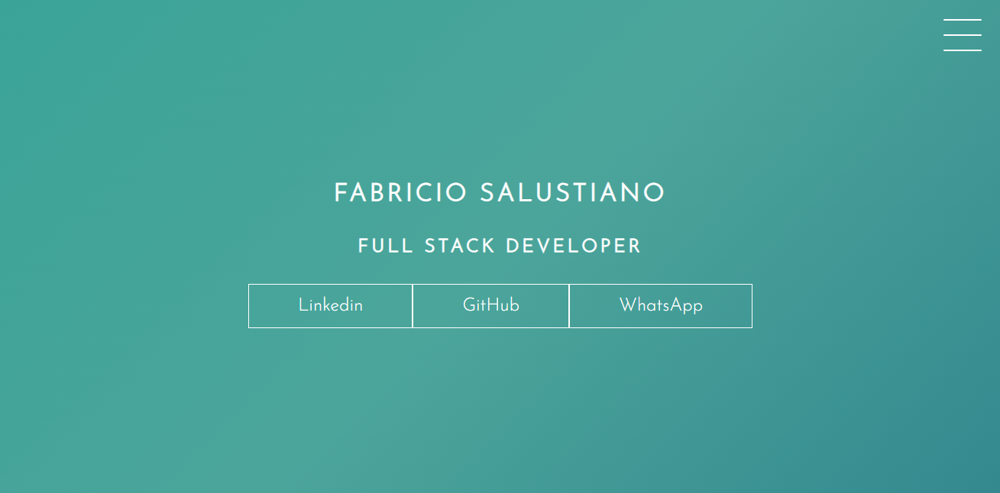
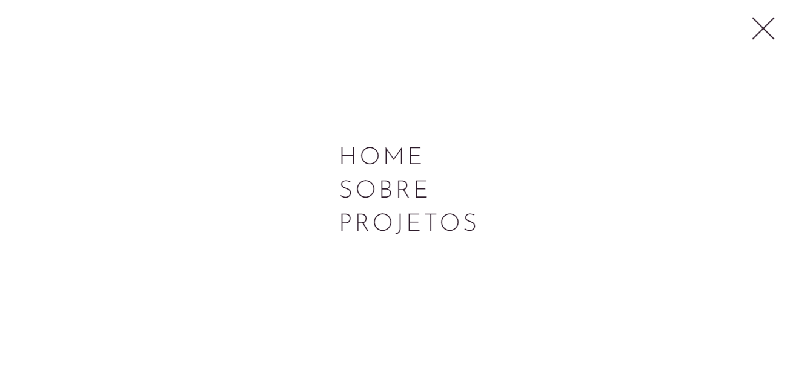
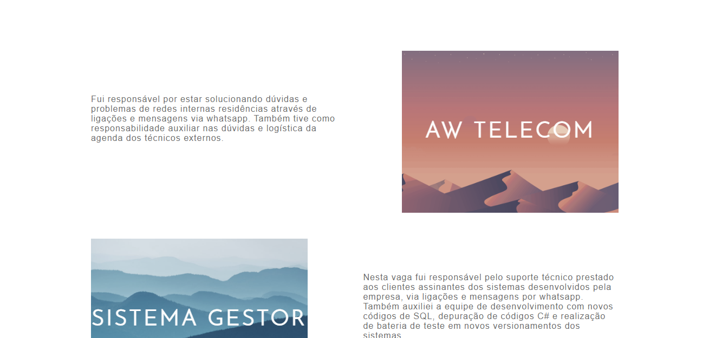
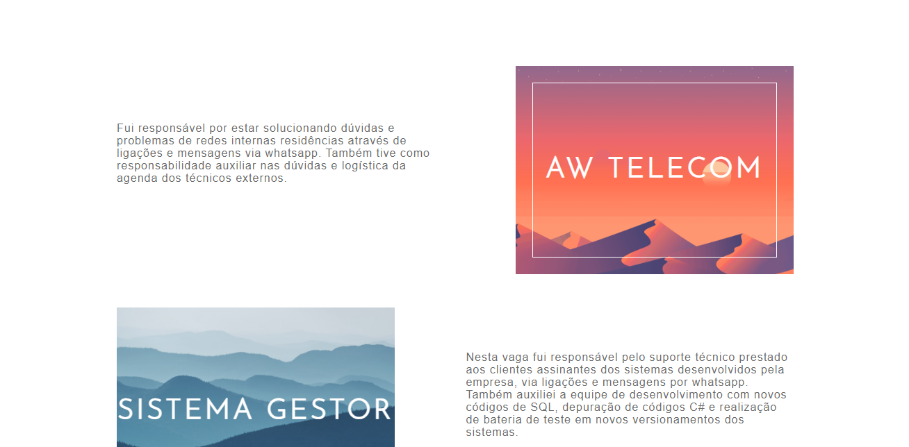

# HTLM/CSS - SitePortifolio
Site construído durante estudos de HTML5 e CSS3 com o intuito de apresentação das praticas aprendidas sobre transitions e animações apenas com CSS. Realizadas muitas animações e transições com CSS3.

Link para visualização do projeto: https://fabricio-salustiano.netlify.app

## Tela inicial:

## Tela de menu:

## Tela de conteúdos:

## Animação de card

Esta animação é ativada quando o mouse se posiciona acima do card.
